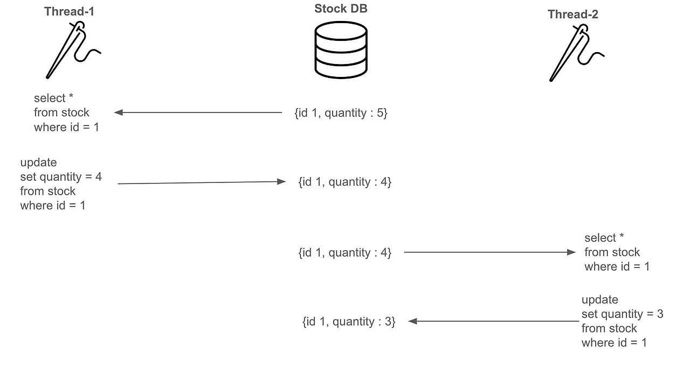
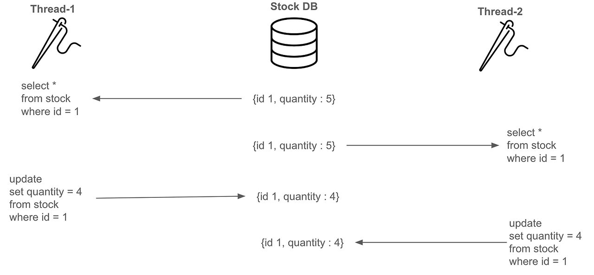
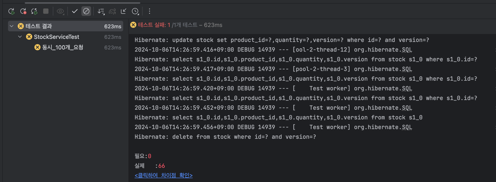

# 동시성 이슈 해결 방법 

### 목적

온라인 쇼핑몰 프로젝트를 진행할 때 **재고** 와 관련되어 동시성 이슈에 대해 생각하지 못했었음.

하지만, 이러한 이슈가 발생할 수 있다는 것을 알게 되었고, 이를 해결하기 위한 방법을 찾아보았음.

멀티 스레드 환경에서 개발할 때 주의해야 한다는 `동시성 제어` 에 대해 알아보자.

---

## 재고 시스템에서 동시성 문제가 발생하는 원인

2개 이상의 스레드가 `재고(Stock)` 에 접근할 때 동시에 접근 및 변경하면서 `Race Condition` 이 발생했기 때문이다.

_기대 상황_



_실제 상황_



위와 같은 Race Condition 상황에서 갱신 손실(Lost Update) 가 발생하여 예상했던 결과로 나오지 않는다.

이제부터 해결 방법을 알아보자.

## 1. Application Level

첫 번째로 알아볼 방법은 _Java Application Level_ 에서 해결하는 방법이다.

동시성 문제에서 주로 사용하는 `synchronized` 키워드를 통해 해결해보자.

### synchronized keyword

작성한 재고 감소 메서드에 `synchronized` 키워드를 붙여 동시에 접근하지 못하도록 막아보자.

```java
    @Transactional
    public synchronized void decrease(Long id, Long quantity) {

        Stock stock = stockRepository.findById(id)
                .orElseThrow(() -> new RuntimeException("stock not found"));

        stock.decrease(quantity);

        stockRepository.save(stock);
    }
```

_결과_



100개의 스레드가 하나씩 처리되어 최종적으로 0이 되는 결과를 예상했지만 그렇지 않다.

**실패 원인**

메서드 위에 `@Transactional` 어노테이션 역할에 대해 생각해보자.

- `@Transactional` 어노테이션은 `AOP` 를 사용한다.
- AOP를 통해 `Proxy` 객체를 생성하고 메서드를 호출하는 방식으로 동작한다.

이러한 방식을 코드로 표현해보자면 다음과 같다.

```java
public class TransactionStockService {

    private StockService stockService;

    public TransactionStockService(StockService stockService) {
        this.stockService = stockService;
    }

    public void decrease(Long id, Long quantity) {

        // start transaction
        startTransaction();

        // call target method
        stockService.decrease(id, quantity);

        // end transaction
        endTransaction();
    }

    private void startTransaction() {
        System.out.println("Transaction started");
    }

    private void endTransaction() {
        System.out.println("Commit");
    }
}
```

- Proxy 객체가 변경사항을 반영하기 전에 다른 스레드에서 재고 수량을 조회하면, 여전히 문제가 발생하는 것이다.

쉽게 설명해보자.

1. 스레드 A가 트랜잭션을 시작하고, stockService.decrease() 메서드를 호출함.
2. 스레드 B가 트래잭션을 시작하고, stockService.decrease() 메서드를 호출하였지만, 대기하고 있음.
3. 스레드 A의 decrease() 메서드가 끝난 후 커밋을 하기 전 단계!
4. 이 때, 스레드 B가 decrease() 메서드 내부에서 **조회** 를 진행하여 stock 수량을 조회함.

이러한 상황이, `synchronized` 키워드와 `@Transactional` 어노테이션을 같이 사용하여도 문제가 발생하는 이유이다.

> 물론, 트랜잭션 어노테이션을 제거하면 문제가 해결이 되기는 한다.

**더 나아가서,**

그렇다면, `@Transactional` 어노테이션을 없애고 `synchronized` 키워드를 쓰면 될까?

- **하나의 프로세스 안에서만 보장** 되는 것을 기억하자.
- 만약, 여러 대의 서버가 존재한다면 이 방법은 적합하지 않다. 
- 즉, Application Level 에서 해결 방안을 찾는 것은 적합하지 않아 보인다.


---

## Reference
[[시스템디자인] 재고시스템으로 알아보는 동시성이슈 해결방법](https://nooblette.tistory.com/entry/%EC%8B%9C%EC%8A%A4%ED%85%9C-%EB%94%94%EC%9E%90%EC%9D%B8-%EC%9E%AC%EA%B3%A0%EC%8B%9C%EC%8A%A4%ED%85%9C%EC%9C%BC%EB%A1%9C-%EC%95%8C%EC%95%84%EB%B3%B4%EB%8A%94-%EB%8F%99%EC%8B%9C%EC%84%B1%EC%9D%B4%EC%8A%88-%ED%95%B4%EA%B2%B0%EB%B0%A9%EB%B2%95-13-%EB%AC%B8%EC%A0%9C-%EC%9D%B8%EC%8B%9D%EA%B3%BC-Application-Level%EB%A1%9C-%ED%95%B4%EA%B2%B0%ED%95%98%EA%B8%B0)
